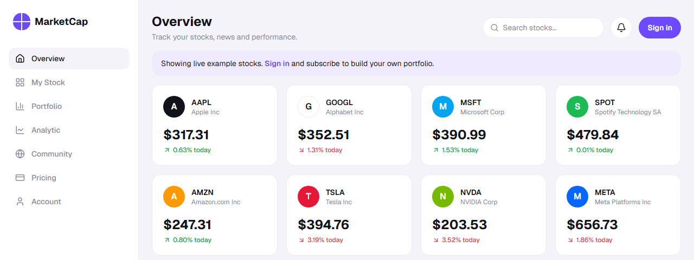
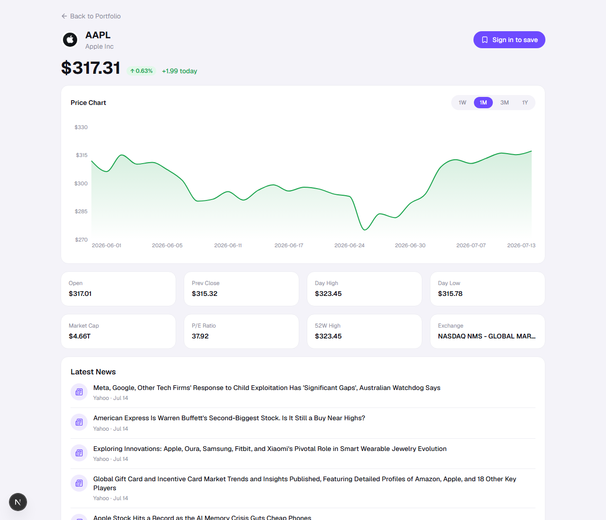
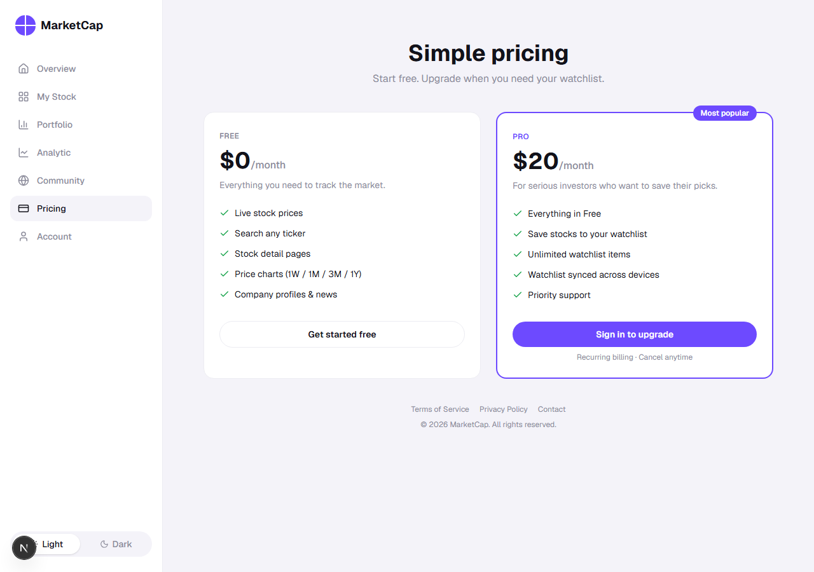

# MarketCap

A stock market dashboard with live prices, historical charts, company news, and a subscription-gated watchlist. Built with Next.js App Router, Supabase, and Stripe.

[](https://github.com/Cina-ken/Market_Cap/actions/workflows/ci.yml)

**Live app:** [marketcap-jade.vercel.app](https://marketcap-jade.vercel.app)



## Features

- **Live quotes & search**:  real-time price, change, and company search backed by [Finnhub](https://finnhub.io).
- **Historical price charts**: 1W / 1M / 3M / 1Y ranges, backed by [Twelve Data](https://twelvedata.com) (see [why two providers](#why-two-market-data-providers)).
- **Company profiles, fundamentals & news**: market cap, P/E, 52-week range, and recent headlines per ticker.
- **Auth + per-user watchlist**: email/password auth via Supabase, with Postgres Row Level Security so each user can only ever see their own saved tickers.
- **Stripe subscriptions (test mode)**: the watchlist is a paid feature; checkout, billing portal, and webhook-driven subscription sync are all wired up end to end.
- **Light/dark theme, responsive layout**:  usable dashboard down to mobile widths.

| Stock detail | Pricing |
| --- | --- |
|  |  |

## Architecture

```
Next.js App Router (Vercel)
├─ Server Components / Server Actions   → data fetching, mutations, Stripe checkout
├─ src/lib/finnhub.ts                   → quotes, search, profiles, news (Finnhub REST)
├─ src/lib/twelvedata.ts                → historical time series for charts (Twelve Data REST)
├─ src/lib/supabase/{server,client,middleware,admin}.ts
│                                       → SSR-aware Supabase clients + session refresh middleware
├─ src/lib/watchlist.ts, watchlist-actions.ts
│                                       → watchlist reads/writes, gated by subscription status
├─ src/lib/stripe.ts, billing-actions.ts, subscription-sync.ts
│                                       → Checkout Sessions, Billing Portal, webhook → Supabase sync
└─ src/app/api/                         → route handlers (quote/history proxies, Stripe webhook)

Supabase (Postgres + Auth)
├─ auth.users                           → email/password auth
├─ watchlist_items (RLS: user_id = auth.uid())
└─ subscriptions   (RLS: user_id = auth.uid(), service-role writes only)
```

Auth state is refreshed on every request via Next.js middleware ([`src/proxy.ts`](src/proxy.ts) → [`src/lib/supabase/middleware.ts`](src/lib/supabase/middleware.ts)), so Server Components always see a valid session without a client-side round trip. Mutations run as Server Actions and call back into Supabase with the user's own session — RLS enforces isolation at the database level rather than in application code. The one place that intentionally bypasses RLS is [`src/lib/supabase/admin.ts`](src/lib/supabase/admin.ts), a service-role client used only by the Stripe webhook handler to write subscription status for a user who isn't the one making the request.

The webhook handler ([`src/app/api/stripe/webhook/route.ts`](src/app/api/stripe/webhook/route.ts)) was verified locally with `stripe listen --forward-to localhost:3000/api/stripe/webhook` and `stripe trigger checkout.session.completed`, signature verification, JSON parsing, and event routing all confirmed working (200s, no server errors) for `checkout.session.completed`, `payment_intent.succeeded`, `payment_intent.created`, and `charge.succeeded`. Note that `stripe trigger`'s generic fixture doesn't set `client_reference_id`/`metadata`, so it exercises the endpoint but not the `syncSubscriptionToSupabase` write path, which only runs for a session created through the app's own `createCheckoutSession()` flow, end-to-end verification of that path means completing a real test-mode checkout through the UI.

`src/proxy.ts` (not `middleware.ts`) is intentional, not a typo: as of Next.js 16, the `middleware.ts` file convention is deprecated in favor of `proxy.ts`,  Next.js 16.2.10 (this project's version) throws a build error if both exist, and warns on `middleware.ts` alone. See [nextjs.org/docs/messages/middleware-to-proxy](https://nextjs.org/docs/messages/middleware-to-proxy).

## Why two market data providers

Finnhub's free tier covers live quotes, search, company profiles, fundamentals, and news,  but its `/stock/candle` (historical OHLC) endpoint is paid-tier only, and price charts were a core part of the product. Rather than drop charts or pay for a tier the rest of the app didn't need, I added [Twelve Data](https://twelvedata.com) as a second provider used exclusively for the `1W/1M/3M/1Y` time series in [`src/lib/twelvedata.ts`](src/lib/twelvedata.ts). That introduced its own constraint: Twelve Data's free tier rate-limits aggressively, and the dashboard's "portfolio value over time" chart needs to sum series across up to 8 tickers at once. `getAggregateHistory` handles this by capping the fan-out at 8 parallel requests, tolerating individual failures (`.catch(() => [])`) instead of failing the whole chart, and reducing to the intersection of dates every series actually returned rather than assuming uniform coverage. It's a small function, but getting it wrong either silently drops tickers from the total or throws away the whole chart when one upstream call times out,  both of which I hit while building it.

## Tech stack

Next.js 16 (App Router, Turbopack) · React 19 · TypeScript · Tailwind CSS · Recharts · Supabase (Postgres, Auth, RLS) · Stripe · Finnhub · Twelve Data

## Getting started

```bash
git clone https://github.com/Cina-ken/Market_Cap.git
cd Market_Cap
npm install
cp .env.example .env.local   # fill in the values below
npm run dev
```

Open [http://localhost:3000](http://localhost:3000).

### Environment variables

| Variable | Used for |
| --- | --- |
| `NEXT_PUBLIC_SUPABASE_URL` | Supabase project URL |
| `NEXT_PUBLIC_SUPABASE_ANON_KEY` | Supabase anon/public key (client + SSR) |
| `SUPABASE_SERVICE_ROLE_KEY` | Server-only key that bypasses RLS; used by the Stripe webhook to sync subscriptions |
| `FINNHUB_API_KEY` | Quotes, search, profiles, fundamentals, news |
| `TWELVE_DATA_API_KEY` | Historical price series for charts |
| `STRIPE_SECRET_KEY` | Server-side Stripe API calls |
| `NEXT_PUBLIC_STRIPE_PUBLISHABLE_KEY` | Stripe.js on the client |
| `STRIPE_WEBHOOK_SECRET` | Verifies incoming Stripe webhook signatures |

Database side, you need two tables in your Supabase project — `watchlist_items` and `subscriptions` — each with RLS enabled and a policy restricting rows to `user_id = auth.uid()`.

### Scripts

```bash
npm run dev    # start the dev server
npm run build  # production build
npm run start  # run the production build
npm run lint   # eslint
npm test       # run the unit test suite (Vitest)
```

## Testing & CI

Unit tests cover the pure formatting/logic helpers (`src/lib/format.ts`, `src/lib/finnhub.ts`, `src/lib/market-hours.ts`, `src/lib/watchlist.ts`) with Vitest. `src/lib/twelvedata.test.ts` specifically covers the three behaviors described above: the 8-ticker fan-out cap, per-ticker failure tolerance, and date-intersection reduction. GitHub Actions ([`.github/workflows/ci.yml`](.github/workflows/ci.yml)) runs lint, tests, and a production build on every push and pull request.

## Docker

```bash
docker build -t marketcap \
  --build-arg NEXT_PUBLIC_SUPABASE_URL=<your-url> \
  --build-arg NEXT_PUBLIC_SUPABASE_ANON_KEY=<your-anon-key> \
  --build-arg NEXT_PUBLIC_STRIPE_PUBLISHABLE_KEY=<your-publishable-key> \
  .
docker run -p 3000:3000 --env-file .env.local marketcap
```

The `NEXT_PUBLIC_*` build args are needed because Next.js inlines them into the compiled output at build time — server-only keys (Finnhub, Stripe secret, Supabase service role) are only read at request time, so they just go in `--env-file` at `docker run`. Omitting the build args still produces a working image, but Supabase-backed routes (auth, watchlist) will fail since the URL/key get baked in as empty strings.

See [`Dockerfile`](Dockerfile) for the multi-stage build (deps → build → standalone runtime image).

## Deployment

The live instance runs on Vercel, connected to this repo's `main` branch, with Stripe running in test mode.

## License

[MIT](LICENSE)
